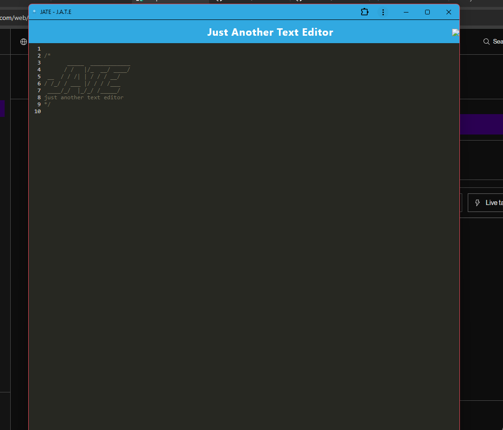

# The Tech Bubble

## Table of Contents
- [Description](#description)
- [Installation](#installation)
- [Usage](#usage)
- [Questions](#questions)

## Description
this app is a an innovative pwa text editor. allowing for live rendering, offline use, and installability

## Installation
by entering into the terminal of the parent folder and typing npm run install and npm run start

## Usage
after running the app just type and it will save real time. click on the button on the top right to use the manifest and use the app while offline.

## Questions
For any questions, you can reach me at:
- GitHub: [MIKEYP53](https://github.com/MIKEYP53)
- Email: mprz646@gmail.com
